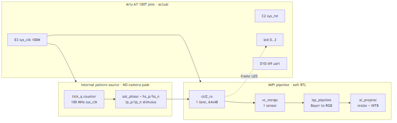
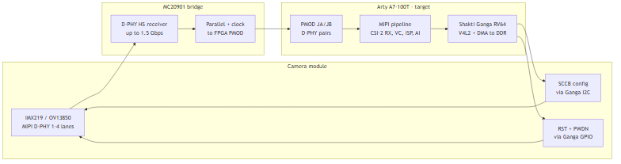
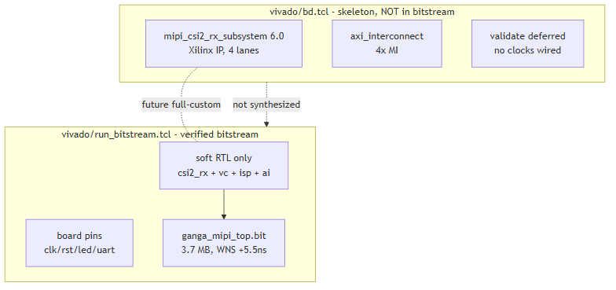
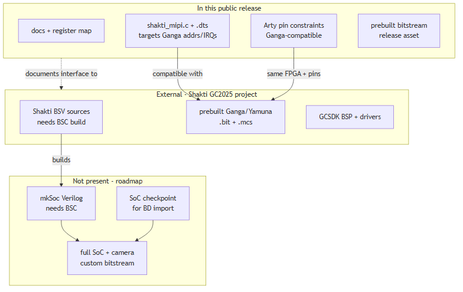

# Q&A Log – Camera Connectivity on Shakti Ganga MIPI

| Field | Value |
|-------|-------|
| Date queries received | 2026-09-15 |
| Date answered | 2026-09-15 |
| Release under review | v0.3-ganga-public |
| Responders | Maintainers, MIPI CSI-2 AI Camera SoC on Shakti Ganga |
| Diagrams | `docs/DIAGRAMS.md`, sources in `docs/diagrams/*.mmd` |
| Evidence doc | `docs/07_Camera_Connectivity_QA.md` |

---

## Q1 (2026-09-15) – How is the camera connected to Ganga? No MIPI signals in the constraints file.

**Verdict: observation correct – valid by design of this release.**

The v0.3 bitstream proves the pipeline with an internal pattern source;
no camera pads exist. The top exposes only `sys_clk`, `sys_rst`,
`led[0..3]`, `uart_txd/rxd`, and `examples/arty_a7_100t/top_ganga_mipi.xdc`
constrains exactly those 9 board pins – zero MIPI lane pins. The CSI-2
LP/HS inputs are driven by an internal tick-counter stimulus.

Actual connectivity (v0.3, what shipped):

*Diagram source: `docs/diagrams/camera_actual.mmd`.*

Target connectivity (rev B roadmap – camera via MC20901 bridge to PMOD,
Ganga I2C/GPIO controlling the sensor):

*Diagram source: `docs/diagrams/camera_target.mmd`.*

**Committed actions (rev B):** add MIPI pad bundle (PMOD JA/JB) to top +
XDC, add pattern-vs-pads select register, rebuild via
`vivado/run_bitstream.tcl`, publish rev-B bitstream.

---

## Q2 (2026-09-15) – MIPI_RX_SYSTEM IP seen in the board files.

**Verdict: clarified – the IP is not in the shipped bitstream.**

The Xilinx `mipi_csi2_rx_subsystem:6.0` IP exists only in the unfinished
block-design skeleton (`vivado/bd.tcl:29`); that BD was never completed
(`validate_bd_design` still commented out, no `.bd` artifact). The verified
bitstream was built by `vivado/run_bitstream.tcl` from soft RTL only –
the netlist proves it (BUFG/CARRY4/LUT/FDCE cells, no Xilinx IP).

Skeleton vs shipped:

*Diagram source: `docs/diagrams/bd_skeleton.mmd`.*

**Committed actions:** none required for evaluation – use the prebuilt
bitstream. The hard IP enters in the full-custom path
(`vivado/build_custom.tcl` + `vivado/bd.tcl`) once SoC clocks exist.

---

## Q3 (2026-09-15) – No Shakti files visible.

**Verdict: clarified – no Shakti BSV/Verilog ships here, by design.**

No Shakti BSV, `mkSoc` Verilog, or `fpga_top` is part of this public
release. Ganga still enters three documented ways: (a) the prebuilt
`ganga_mipi_top.bit` release asset; (b) the Ganga-addressed driver +
device tree (`sw/linux_v4l2/`, `0x44Ax_xxxx`, PLIC IRQ); (c) the
Ganga-compatible Arty constraints. SoC sources live in the external
Shakti GC2025 project.

File map (in-release vs external vs missing):

*Diagram source: `docs/diagrams/shakti_files.mmd`.*

**Committed actions:** evaluate with the prebuilt bitstream + V4L2 driver
per `docs/quickstart.md`. SoC rebuild path documented in
`vivado/README.md` (`SHAKTI_GC2025`, BSC prerequisites).

---

---

## Update 2026-09-15 (same day) – Q1 committed actions built

Rev B implemented, verified, and released:

- Pads: `cam_lp_p/n` JA1/JA2 (G13/B11), `cam_hs_p/n` JA3/JA4 (A11/D12),
  `cam_clk` JA7 (D13), `cam_sel` JA8 (B18); 2FF sync + mux.
- XSIM: pattern frames flowing, pads frames flowing with mux selected.
- Bitstream `examples/arty_a7_100t/ganga_mipi_top_revB.bit` (3.65 MB):
  DRC 0 errors, WNS +4.945 ns / WHS +0.094 ns, 107 LUTs / 185 regs.
- Wiring + programming: `examples/arty_a7_100t/README.md`; numbers:
  `docs/BITSTREAM_GANGA.md`; diagram set unchanged (target now built).

*End of log 2026-09-15. New queries append as dated sections below.*
